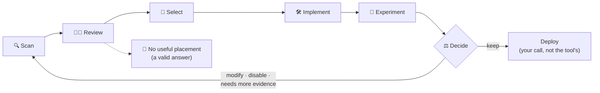

<div align="center">

# 🧭 JEV Integration Evaluator

**Find where an AI decision point would actually help your codebase — and prove it before you trust it.**

[](CHANGELOG.md)
[](pyproject.toml)
[](LICENSE)
[](#-safe-by-default)

*A CompleteTech LLC agent skill and Python CLI*

</div>

---

## What is this?

JEV answers small, structured questions — "which of these five known actions fits this situation?" — instead of generating free text. Many codebases have spots where a brittle keyword check or heuristic makes exactly that kind of judgment call.

This toolkit **scans a repository, finds those spots, scores them, and walks you through testing whether JEV actually does better** — with real experiments, not vibes. It never runs your code, never calls the network, and never changes anything unless you explicitly approve an exact, reviewed patch.

> **LLMs generate. JEV classifies, selects, and evaluates. Deterministic code enforces. Instrumentation measures. Experiments decide whether JEV stays.**

## 🛡️ Safe by default

| | |
|---|---|
| 📖 **Read-only** | Scans parse source; they never import or execute your code |
| 🔌 **Offline** | No API key, no network — until you explicitly authorize and budget it |
| ⏸️ **Runtime off** | Generated adapters ship disabled, behind flags, with fallback |
| ✍️ **Approved changes only** | Edits require your review and an exact plan-digest approval |
| 🧪 **Evidence-gated** | Synthetic or demo results can never justify adoption |

> [!TIP]
> "No useful JEV placement found" is a **successful result**, not an error. The tool is built to say no.

## 🚀 Quick start

Needs Python 3.10+. Runtime dependencies are PyYAML, jsonschema, and packaging, plus tomli on Python 3.10.

```bash
python -m venv .venv && source .venv/bin/activate   # Windows: .venv\Scripts\Activate.ps1
python -m pip install -e ".[test]"
```

Scan a repository and review what it found:

```bash
python -m jev_integration_evaluator scan --repo /path/to/repo --out ./analysis --depth STANDARD
python -m jev_integration_evaluator onboard --inventory ./analysis/jev-opportunities.json
```

The scan writes ranked opportunities, an architecture map, integration and experiment plans, a risk analysis, and machine-readable JSON/CSV — into `./analysis`, outside your repo. The results report says "no experiment was run" until you actually run one.

For native Windows source-bound discovery, use a local NTFS drive path and a
new report path outside the target (PowerShell):

```powershell
python -m jev_integration_evaluator repository-discovery `
  'C:\src\my-project' --out 'C:\jev-reports\capabilities.json'
```

See the [platform matrix](references/platform-support.md) for Windows versions,
link handling, UNC outcomes and path limits.

The separate [JavaScript recipe C template catalog](references/javascript-recipe-c-template-v1.md)
validates reviewed ESM, CommonJS and TypeScript source through trusted external
tooling and materializes source-bound planner inputs on Linux. Package install,
normal entrypoint launch and connected-mode qualification remain pending.

The [six-use-case source matrix](references/use-case-template-matrix-v1.md)
pins offline host contracts for registered tools, graph identity, retrieval,
completion, claim support and safe retention. The five new fixture oracles are
tested offline. A shared fixture wheel is also installed and invoked through
its normal off-mode console on Linux CPython 3.13; individual template
transforms, supervised installed delivery, provider modes and benefit remain pending.

Want to see everything working first? Run the bundled offline demo:

```bash
python -m jev_integration_evaluator scan --repo examples/coding-agent --out demo/agent
python examples/run_demo.py --out demo/runtime
python -m pytest -q && python scripts/validate_package.py
```

> [!WARNING]
> Every model response in `examples/` is **synthetic**. Demos prove the tools work; they never prove a live model helps.

## 🗺️ How it works



Each stage rechecks source identity and requires its own explicit authorization — no stage unlocks the next one automatically.

## 📚 Learn more

| I want to… | Read |
|---|---|
| Follow the full staged workflow | [`SKILL.md`](SKILL.md) |
| Answer intake questions once, up front | [`ONBOARDING.md`](ONBOARDING.md) |
| Discover and review candidates in a repo | [`references/repository-discovery-v1.md`](references/repository-discovery-v1.md) |
| Check qualified platforms and filesystem limits | [`references/platform-support.md`](references/platform-support.md) |
| Understand the 13 A–M placement patterns | [`references/placement-patterns.md`](references/placement-patterns.md) |
| Pick a placement to prepare | [`references/experimental-selection.md`](references/experimental-selection.md) · [`references/placement-selection-v1.md`](references/placement-selection-v1.md) |
| Generate and apply a reviewed code change | [`references/executable-integrations.md`](references/executable-integrations.md) |
| Render versioned source-bound planner inputs | [`references/template-catalog-v1.md`](references/template-catalog-v1.md) |
| Bind recipe C to a reviewed Python console command | [`references/template-python-entrypoint-v1.md`](references/template-python-entrypoint-v1.md) |
| Generate a bounded method, async, or fixed-positional Python adapter runtime | [`references/python-adaptation-runtime-v1.md`](references/python-adaptation-runtime-v1.md) |
| Build and install a verified Python host in an owned offline environment | [`references/template-installation-v1.md`](references/template-installation-v1.md) |
| Modify JavaScript/TypeScript hosts | [`references/javascript-typescript-backend-v1.md`](references/javascript-typescript-backend-v1.md) |
| Run rigorous before/after experiments | [`references/experimental-methodology.md`](references/experimental-methodology.md) · [`references/lifecycle-and-evidence.md`](references/lifecycle-and-evidence.md) |
| Inspect synthetic coding-agent completion and retention studies | [`examples/coding-agent/README.md`](examples/coding-agent/README.md) |
| Read the frozen issue #44–#49 study outcomes | [`reports/`](reports/README.md) |
| Operate multiple placements with budgets and canaries | [`references/operational-evidence-v1.2.md`](references/operational-evidence-v1.2.md) |
| Connect to the live JEV API | [Live integration](#-going-live) below · [`references/security-and-privacy.md`](references/security-and-privacy.md) |
| Coordinate template delivery through reviewed PRs and merge | [`references/template-delivery-orchestration-prompt.md`](references/template-delivery-orchestration-prompt.md) |
| Supervise an offline installed Python console and its owned session | [`references/template-delivery-session-v1.md`](references/template-delivery-session-v1.md) |
| See what each release validated | [`CHANGELOG.md`](CHANGELOG.md) · [`validation/`](validation/) |

Every command also documents itself: `python -m jev_integration_evaluator --help`.

## 🔌 Going live

Local scans and demos need no key. To deliberately send approved, minimized decision evidence to the real API (`/v1/systemone`, pinned to `jev-1.13.0`), set `TYPESAFE_API_KEY` and pass explicit network and budget flags:

```bash
python -m jev_integration_evaluator replay --input approved-decisions.jsonl --allow-network \
  --max-calls 5 --max-total-cost 0.01 --cost-upper-bound-per-call 0.002 \
  --out approved-replay-results.json
```

No price is silently assumed, and a model answer is never treated as permission to act — your host policy stays in charge.

Reviewed Python hosts can use the opt-in `HostRuntimeLifecycle` for connected
shadow, canary, or active operation. The host supplies an exact expiring egress
grant, a credential *reference*, a trusted digest-authentication callback, and
a durable single-process budget/effect ledger. Canary and active also require
raw observed holdouts, a frozen paired study, and exact runtime and deployment
receipts; the component recomputes those gates before startup. See the
[mode and authority table](references/host-runtime-lifecycle.md). Call
`HostRuntimeLifecycle.qualification_inputs()` for the redacted inputs needed
by an independent live qualification. Offline fixture tests do not establish
real provider connectivity, operational safety, or measured benefit.

## ⚠️ Honest limits

- **No live-model benefit has been measured** for this build. All validation to date uses synthetic fixtures and mocked HTTP.
- Static analysis can't see every dynamic call, callback, or generated file. A partial scan is not proof a repo has no opportunities.
- Code changes are supported for **bounded, documented Python shapes** (and one JS/TS shape); everything else is analysis-only and says so.
- The generated Python adaptation runtime supports normal installed commands in off and offline synthetic shadow for its reviewed regular-package shapes. Connected async/canary/active use and a general multi-statement rewriter are not qualified.
- Native Windows discovery is qualified for local NTFS drive paths on Windows 11 and Windows Server 2022. Windows Server 2022 CI ran the required discovery fixtures on CPython 3.10 and 3.13 with real symlinks and zero skips. UNC/network roots and broader runtime/session workflows have separate limits; see the [platform matrix](references/platform-support.md).
- The test runner is not a sandbox; use an isolated environment for untrusted projects.

Full boundaries, trust assumptions, and validation records: [`references/`](references/) and [`validation/`](validation/).

## 📜 License

MIT for code and authored docs — see [`LICENSE`](LICENSE) and [`BRANDING.md`](BRANDING.md). No affiliation with TypeSafe is claimed.

---

<div align="center">
<sub>🧭 <b>jev-integration-evaluator</b> · CompleteTech LLC · Evidence over assertion, always.</sub>
</div>
