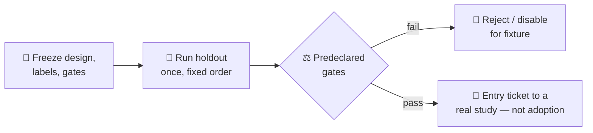

# 📊 Frozen study reports

**Six pre-registered synthetic experiments, six honest answers. Five said no — and that's the tool working.**

*Issues #44–#49 · CompleteTech LLC*

---

## What is this?

Each report below summarizes one **frozen, pre-registered, offline synthetic holdout study** of a candidate JEV placement in the bundled example systems. Every study froze its cases, scorer-only labels, thresholds, resource limits, and stop rule *before* the holdout ran; every scheduled failure stayed in the denominator; and every decision was read off the predeclared gates, not negotiated afterward.

> [!TIP]
> A rejection here is a **successful result**. The evaluator exists to say no when deterministic code already wins, when a treatment adds failures, or when the margin isn't there.

## 🗂️ The six studies

| Issue | Report | PR · signed head → merge | Frozen evidence | Result and adoption limit |
|---|---|---|---|---|
| **#44** Graph identity | [🕸️ Report](issue44-graph-identity.md) | [#62](https://github.com/Jev-Engineering/jev-integration-evaluator/pull/62) · `08b2a9f` → `4698c4b` | [JSON](../examples/graph-system/report.v1.json) | 16 paired holdouts; **reject** the JEV arm. |
| **#45** RAG evidence | [📚 Report](issue45-rag-evidence.md) | [#65](https://github.com/Jev-Engineering/jev-integration-evaluator/pull/65) · `10cd1d2` → `6babaf0` | [JSON](../examples/rag-system/study45_v2_report.json) | 10 new holdouts; **reject** under failure and resource gates. |
| **#46** Completion | [✅ Report](issue46-completion.md) | [#69](https://github.com/Jev-Engineering/jev-integration-evaluator/pull/69) · `94c2e5b` → `bbd7730` | [JSON](../validation/issue46-holdout-report.json) | 24 holdouts per arm; **disable for this fixture** after false completions and a safety violation. |
| **#47** RAG claim checking | [🔍 Report](issue47-rag-claim-checking.md) | [#67](https://github.com/Jev-Engineering/jev-integration-evaluator/pull/67) · `96b8851` → `4f78a9c` | [JSON](../examples/rag-system/study47_report.json) | 15 holdouts across four arms; **reject** the JEV arm. |
| **#48** Routing | [🔀 Report](issue48-routing.md) | [#64](https://github.com/Jev-Engineering/jev-integration-evaluator/pull/64) · `7b7a98e` → `f9203f5` | [JSON](../validation/issue48-routing-report.json) | 12 holdouts; deterministic and JEV both 12/12. **Disable JEV for this fixture** — no incremental benefit. |
| **#49** Retention | [🧠 Report](issue49-context-retention.md) | [#71](https://github.com/Jev-Engineering/jev-integration-evaluator/pull/71) · `698c71d` → `82cc8c0` | [JSON](../validation/issue49-holdout-report.json) | Synthetic gates met across efficacy and guarded-safety holdouts; **live adoption needs more evidence**. |

## ⚠️ How to read these reports

- **Everything here is synthetic.** Model responses are recorded or authored fixtures; costs and latencies labeled *simulated* or *synthetic* are predeclared assumptions, never provider measurements. Only local Python wall time was actually measured, and only where a report says so.
- **Labels are scorer-only declared truth**, frozen separately from predictions and never shown to the arms under test — but they are the case author's adjudication, not an independent panel.
- **No study measures live benefit.** Even #49's passing screen explicitly withholds live adoption (`not_authorized_no_real_history_or_provider`). A synthetic pass is the prerequisite for a real study with observed tasks, a real provider, and measured cost and latency — nothing more.
- **Each Markdown report is a summary.** The frozen JSON report is the artifact of record: per-case rows, arm orders, seeds, thresholds, and SHA-256 digests binding every input and source file.

---

🧭 <b>jev-integration-evaluator</b> · CompleteTech LLC · Evidence over assertion, always.

